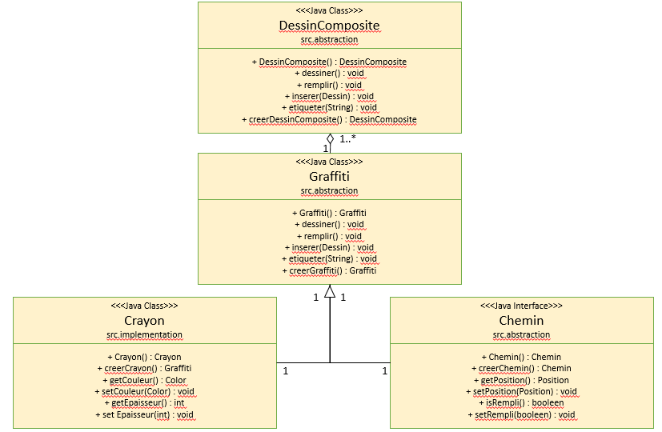

#Mini-Projet : Dessin Vectoriel
---------------

##Choix des Patrons de conception

1. Nous avons choisi le patron de conception composite pour la représentation des Dessins. Un Dessin est vu alors comme un Arbre dont les feuilles sont soit un DessinVide, suivant le modèle du patron Singleton, soit un DessinComposite, dont nous verrons le patron de conception dans ce qui suit.

2. Concernant le patron de conception de la class DessinComposite, nous avons intégré des instances d'une classe nommée Graffiti, composée d'un Crayon et d'un Chemin, au nombre de 1 à n qui composent un DessinComposite. 
