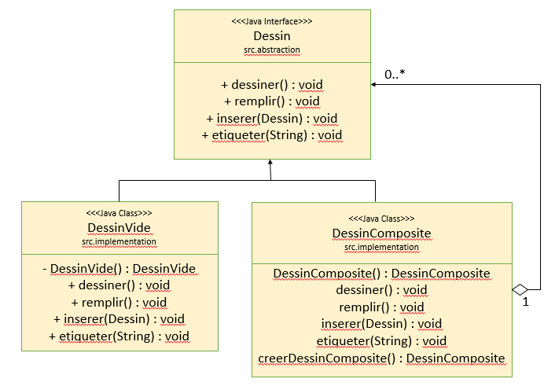
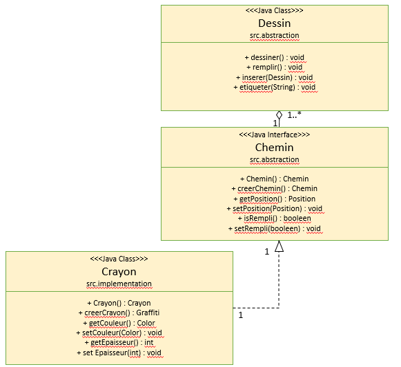

#Mini-Projet : Dessin Vectoriel
---------------

##Choix des Patrons de conception

1. Nous avons choisi le patron de conception composite pour la représentation des Dessins. Un Dessin est vu alors comme un Arbre dont les feuilles sont soit un DessinVide, suivant le modèle du patron Singleton, soit un DessinComposite, qui n'est en réalité qu'une liste de Dessin.

2. Concernant l'implémentation de l'interface Dessin, elle se fait en deux étapes. La première étape consiste à étendre l'interface Dessin en une classe abstraite Chemin, qui aura comme variable d'instance un objet de type Crayon à qui elle pourra par la suite déléguer des méthodes concernant l'épaisseur du trait par exemple 

3. La deuxième étape est ensuite d'instancier des Chemin, pour cela, de nombreuses classes implémentent cette interface telles que Cercle ou Segment pour ne citer qu'elles.

4. Concernant les méthodes dessiner, remplir, insérer et étiqueter, elles seront réalisé aux moyens de visiteurs. L'avantage à utiliser un patron visiteur est de séparer les services des classes d'implémentation. On peut alors identifier clairement les services proposés puisqu'un service correspond à une classe de visite. 

5. Enfin des interpréteurs permettent de réaliser le dessin physique en image pixellisé (bibliothèque AWT) et en image vectorielle (format SVG). L'avantage de ces interpréteurs étant qu'un interpréteur est associé à un type de format d'image. 

##Résumé du sprint 1
Ce qui a été réalisé : 

* conception de l'architecture logicielle (5 heures)
* implémentation du patron composite (4 heures)
* implémentation de la plupart des Chemins (4 heures)
* implémentation du patron visiteur (qu'il ne restera qu'à implémenter en fonction des services à proposer) (1 heure)
* création d'une fabrique des Chemins et Dessin élémentaires (1 heure)
* création des tests unitaires réalisés avec JUnit sur la fabrique (1 heure)
* debogage et réajustements (4 heures)

##Déroulement du sprint 2

Ce qui doit être réalisé :

* implémentation des visiteurs (durée estimée : 1 heure)
* des tests unitaires sur les visiteurs (durée estimée : 1 heure)
* implémentation du patron interpréteur pour java.AWT(durée estimée : 3 heures)
* implémentation du patron interpréteur pour SVG (durée estimée : 4 heures)
* réalisation de l'interface (durée estimée : 4 heures)
* création des tests sur les interpréteurs (durée estimée : 1 heure)
* débogage et réajustements (durée estimée : 4 heures)
* rédaction d'une JavaDoc et du fichier README (durée estimée : 1 heure)