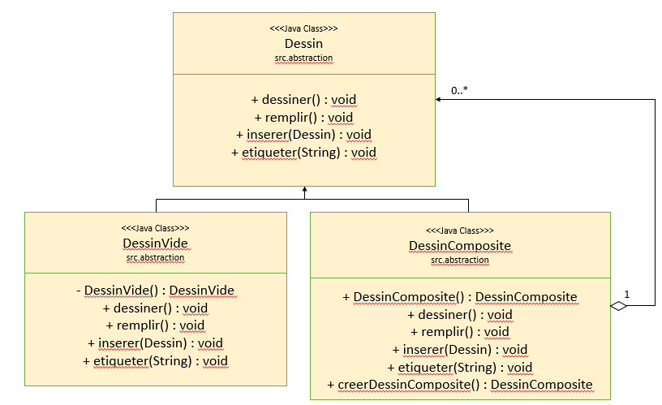

#Mini-Projet : Dessin Vectoriel
---------------

##Choix des Patrons de conception

1. Nous avons choisi le patron de conception composite pour la représentation des Dessins. Un Dessin est vu alors comme un Arbre dont les feuilles sont soit un DessinVide, suivant le modèle du patron Singleton, soit un DessinComposite, dont nous verrons le patron de conception dans ce qui suit.

2. Concernant l'implémentation de l'interface Dessin, elle se fait en deux étapes. La première étape consiste à étendre l'interface Dessin en une interface Chemin, qui aura comme variable d'instance un objet de type Crayon à qui elle pourra par la suite déléguer des méthodes concernant l'épaisseur du trait par exemple 

3. La deuxième étape est ensuite d'instancier des Chemin, pour cela, de nombreuses classes implémentent cette interface.